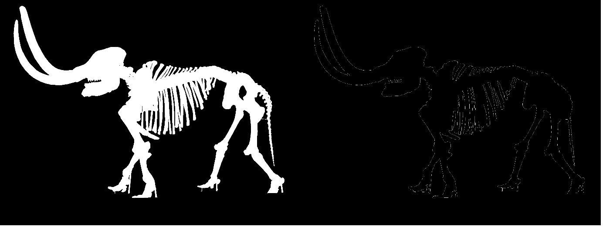
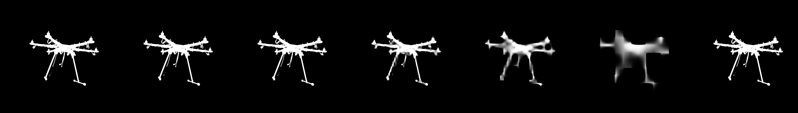
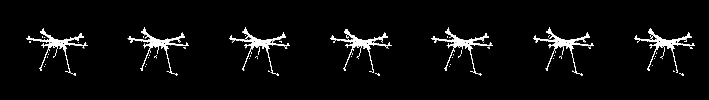
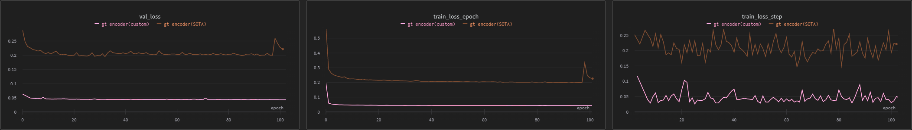

<h1>
    IS-Net/GT-Encoder Tuning and Data Augmentation
</h1>

- paper : [Highly Accurate Dichotomous Image Segmentation ECCV 2022](https://arxiv.org/pdf/2203.03041.pdf)
- github : [DIS](https://github.com/xuebinqin/DIS)

<br>

## Updates!
- requirements for this repository updated!
- Please follow walkthrough in [U2Net-Multi-Gpus-Training](https://github.com/skuley/U2Net-Multi-Gpus-Training)

## Checkpoints
- Gt_Encoder : [gtencoder](https://drive.google.com/drive/folders/17zk1NtoYAEtZPTh3ABqRIc1WQm0tm86n?usp=sharing)

# Data Augmentation
## Edged GT


- Added BCE_Loss calculation between the output and Edged after filled GT loss calculation to aid the seperation between foreground and background.
- Got reference from [EGNet: Edge Guidance Network for Salient Object Detection](https://arxiv.org/pdf/1908.08297.pdf) which is mainly about aiding discriminate foreground better from similar color range background.

## Random Blur


- Added blurred patch on foreground and background boundary locations to all original images to increase complexity.
- Extracted the biggest object from GT by selecting the largest contour area.
- Number of pathces can be chosen when calling function by passing down through keyword argument
- Area of patches will be randomly chosen.

```python
from utils.augmentation import RandomBlur

random_blur = RandomBlur()
random_blur(image="opencv original image", mask="opencv GT mask", patches=2, patch_size=20)
```

## [Albumentation](https://albumentations.ai/) 
I have resized DIS5K/DIS-TR into 1280x1280 and saved just to speed up training process. Thus, if this process was not fullfiled, it is necessary to resize inputs into required size [1280x1280]
- RandomCrop 1024x1024
- 50% Random Horizontal Flip
- 80% Random Vertical Flip
- 80% 90 degree Rotation
- 80% ElasticTransform

<br><br>
# Model Tuning
## GT Encoder 
- In ISNet model, All feature maps below EN_2 stage, the size of output get smaller as stage goes on.
- GtEncoder [Stage1, Stage2, Stage3, Stage4, Stage5, Stage6, GT]
<br>
- GtEncoder Custom [Stage1, Stage2, Stage3, Stage4, Stage5, Stage6, GT]
<br>
- In order to preserve detailed pixels in upsampling, I've continuously enlarged with [convolutional transpose 2d]() to all stages until its' same size as EN_2 shape.
- Even if GT Encoder is overfitted, during Feature Synchronization with Image Segmentation Component, stages below EN_2's preservation seemed isn't suitable for pixel wise segmentation.
- I've used same ISNet augmentation in training gt_encoder because I've thought that it would help in training ISNet.

